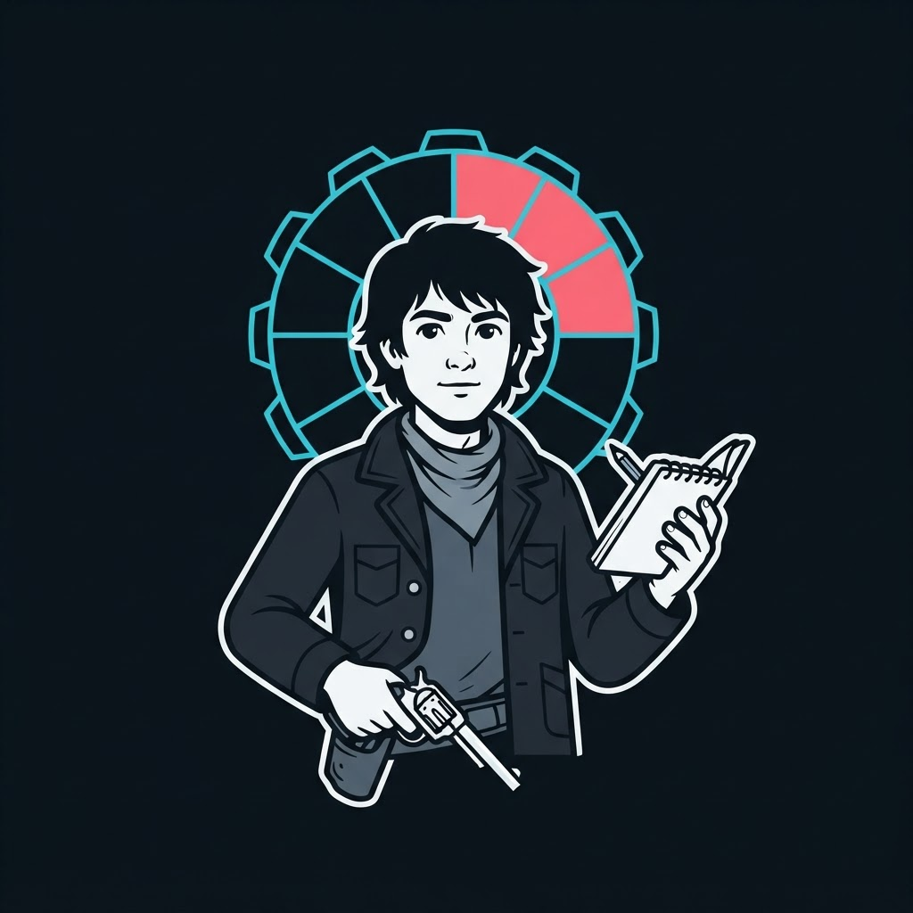
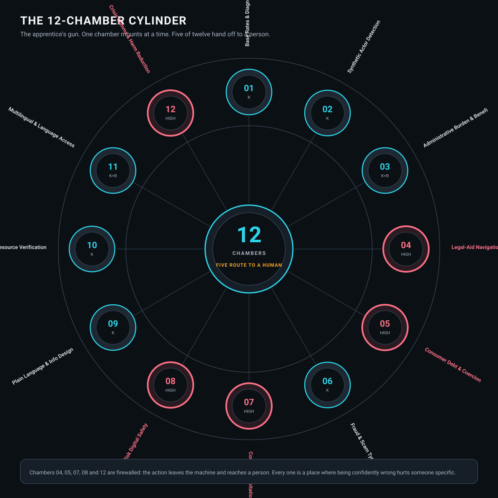
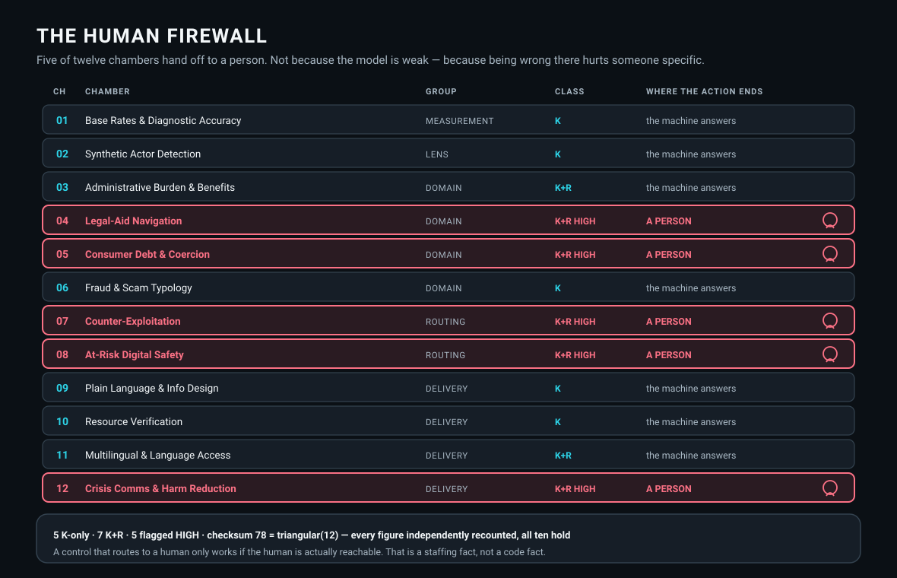

# THE APPRENTICE

### The gunslinger's apprentice — twelve chambers, and five of them hand off to a person

A member repository of the **[ka-tet](https://github.com/indicaindependent/ka-tet)**.

The apprentice carries a smaller gun and the harder brief. His discipline is **dealing with
humans**, and his twelve chambers are not a list of interests — they are the caseload of
people in difficulty.

Benefits and administrative burden. Legal aid. Consumer debt and coercion. Fraud.
Exploitation. Digital safety. Crisis communication.

 

---

## THE CYLINDER

    MEASUREMENT  1 chamber      how accurate is this, really
    LENS         1 chamber      is the thing I am looking at even real
    DOMAIN       4 chambers     the subject-matter knowledge
    ROUTING      2 chambers     where does this person actually need to go
    DELIVERY     4 chambers     can they understand and use the answer

**Note the shape of that list.** Only four of twelve chambers are subject-matter knowledge.
The rest are spent on *checking whether the answer is true*, *working out where the person
actually needs to go*, and *making sure they can use what they are given*. A router built
only of domain expertise would be twelve chambers of confident, unusable advice.

---

## THE HUMAN FIREWALL

    K        knowledge only — the chamber answers
    K+R      knowledge and routing — it answers and directs
    HIGH     the action routes to a HUMAN. Five of twelve.

**Chambers 04, 05, 07, 08 and 12 are firewalled.** Legal-aid navigation, consumer debt and
coercion, counter-exploitation, at-risk digital safety, crisis communication.

Every one of those is a place where **being confidently wrong hurts a specific person.** So
the design does not rely on the model being careful. The action leaves the machine.

**One honest limit:** a control that routes to a human only works if a human is actually
reachable. That is a staffing fact, not a code fact, and no diagram can fix it.

---

## VERIFICATION

The diagram is the source of truth, and its arithmetic was **checked rather than trusted** —
labels parsed out of the vector file, not read off the picture.

| Claim on the diagram | Independently counted | Result |
|---|---|---|
| MEASUREMENT 1 | 1 | OK |
| LENS 1 | 1 | OK |
| DOMAIN 4 | 4 | OK |
| ROUTING 2 | 2 | OK |
| DELIVERY 4 | 4 | OK |
| 5 K-only | 5 | OK |
| 7 K+R | 7 | OK |
| 5 flagged HIGH | 5 | OK |
| checksum 78 = triangular(12) | 78 | OK |
| 12 chambers loaded | 12 | OK |

**Every figure holds.**

*Logged, because this ka-tet records its own errors: the first parse of that file was wrong.
The token `12` appears twice in it, so a naive scan overwrote chamber 12 and reported
"Checksum of slots" as a discipline. Bounding the scan to the wheel region fixed it. Reading
a repeated token instead of the structure is the same class of error as trusting a proxy for
a source.*

---

## A TITLE ALONE IS COSPLAY

The cylinder's own doctrine:

> **Every chamber holds a dated, source-cited brief that expires.**
> **A title alone is cosplay.**

Twelve further disciplines were pruned and archived — **not** seats. A roster you never cut
is a roster you never audited.

**One open item, stated because the cylinder states it:** the earliest brief expiry is
approaching, and expiry is currently **unenforced**. An expired chamber that still fires does
so while believing it is current.

---

## THE CREED

**I do not aim with my memory.**
*Memory is fluent, and fluency is not a source.*
**I aim with the record.**

**I do not fire because I can reach the trigger.**
*Access is not authority, and a key is not a warrant.*
**I fire on mandate.**

**I do not close on confidence.**
*Confidence is what a mistake feels like from the inside.*
**I close on the check.**

Original composition — see [ATTRIBUTION.md](ATTRIBUTION.md).

## THE OTHER SEATS

The ka-tet is a **wheel, not a ladder** — every seat is reachable from every other one,
not only through the hub.

| Seat | What it holds |
|---|---|
| **[The Gunslinger](https://github.com/indicaindependent/the-gunslinger)** | Twenty-four chambers, exactly one mounted at a time. |
| **[The Archivist](https://github.com/indicaindependent/the-archivist)** | The companion seat. One hand writes, and it reads back before it calls anything done. |

Two seats hold no repository. **The Master** is the human at the top, and **The Dinh** sits
directly beneath him and may decide in his place. The wheel topology, the five seats and the
shared creed are all in the **[ka-tet](https://github.com/indicaindependent/ka-tet)**.

---

*Twelve chambers. Five of them end with a person.*
